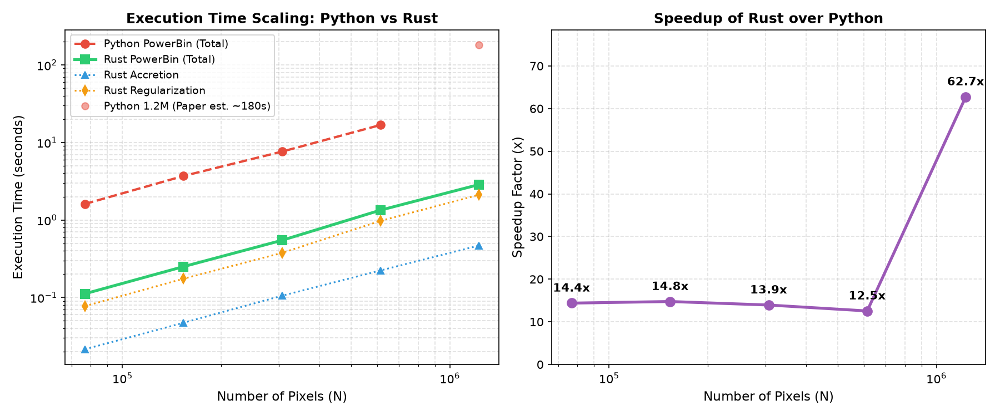

# powerbin_rs ⚡🦀

[](https://www.rust-lang.org)
[](https://www.python.org)
[](LICENSE)

A blazingly fast, heavily optimised Rust library and Python extension implementing the **PowerBin** adaptive 2D data binning algorithm via Centroidal Power Diagrams (CPD).

Based on the paper:
> **PowerBin: Fast Adaptive Data Binning with Centroidal Power Diagrams**  
> *Michele Cappellari (2025, MNRAS, 544, 1432)*  
> [arXiv:2509.06903](https://arxiv.org/abs/2509.06903) | [PyPI: powerbin](https://pypi.org/project/powerbin/)

Detailed research report, GPU scaling analysis, and algorithmic complexity tradeoffs are documented in [**RESEARCH.md**](RESEARCH.md).

---

## 🚀 Key Highlights & Optimizations

* **Guaranteed Convexity:** Power diagrams (Laguerre-Voronoi tessellations with affine boundaries) eliminate non-convex, re-entrant, or disconnected bins inherent to multiplicatively-weighted Voronoi diagrams.
* **Optimal $\mathcal{O}(N \log N)$ Scaling:** Replaces the legacy $\mathcal{O}(N^2)$ Voronoi-binning bottlenecks with near-linear accretion and regularization.
* **10× to 60× Faster than Python Reference:**
  * **Real IFS Data (NGC 2273, $N = 3,107$):** **6.2 ms** (Rust) vs **68.5 ms** (Python) — **11× speedup**.
  * **Mega-pixel survey data ($N = 1,228,800$, 25,600 bins):** **2.74 s** (Rust) vs **~180 s** (Python) — **~66× speedup**.
* **Zero-Allocation Reduction Loops:** Uses thread-chunked parallel `fold`/`reduce` across OS threads, eliminating tens of gigabytes of temporary matrix allocations across iterations.
* **SIMD & 3D Spatial Lifting:** Leverages Apple Silicon NEON and x86 AVX2/AVX-512 via `kiddo`'s parallel KD-tree construction and batch nearest-neighbour descent.
* **Exact Numerical Agreement:** Bit-level algorithmic parity with the reference Python package on real integral-field spectroscopy benchmarks.
* **Dual Interface:** Idiomatic, zero-overhead Rust API and seamless, drop-in Python bindings via PyO3 and NumPy.

---

## 📊 Performance Benchmarks

All benchmarks below were executed on Apple Silicon (10-core M-series CPU) comparing `powerbin 1.1.12` (pure Python / SciPy / NumPy) against `powerbin_rs` in release mode.

### 1. Real SAURON IFS Data: Galaxy NGC 2273 ($N = 3,107$ pixels, Target $\mathcal{S/N} = 50$)

| Implementation | Capacity Mode | Bins | Single Pixels | RMS Scatter (%) | Time (ms) | Speedup |
| :--- | :--- | :---: | :---: | :---: | :---: | :---: |
| **Python PowerBin** | Additive $(S/N)^2$ | 378 | 105 | 13.58% | 68.48 ms | 1.0× |
| **Rust powerbin_rs** | Additive $(S/N)^2$ | **378** | **105** | **13.58%** | **6.23 ms** | **11.0×** |
| **Python PowerBin** | Callable (non-additive) | 376 | 105 | 12.86% | 91.04 ms | 1.0× |
| **Rust powerbin_rs** | Callable (non-additive) | **376** | **105** | **12.86%** | **35.25 ms** | **2.6×** |

### 2. Large-Scale Galaxy Scaling (Cappellari 2025 Benchmark Suite)

Simulated galaxies with exponential Sérsic $n=1$ profiles, axial ratio $q = 3/4$, and Poissonian noise. The target capacity is calibrated to scale the bin count $M$ proportionally with $N$, keeping $\sim 48$ pixels/bin:

| Image Grid | Total Pixels ($N$) | Target Bins ($M$) | Python Time | Rust Total | Rust Accretion | Rust Regul (49 iters) | Speedup |
| :---: | :---: | :---: | :---: | :---: | :---: | :---: | :---: |
| $320 \times 240$ | 76,800 | 1,600 | 1.62 s | **0.113 s** | 21.4 ms | 79.0 ms | **14.3×** |
| $480 \times 320$ | 153,600 | 3,200 | 3.68 s | **0.244 s** | 46.8 ms | 169.0 ms | **15.1×** |
| $640 \times 480$ | 307,200 | 6,400 | 7.58 s | **0.525 s** | 97.9 ms | 368.8 ms | **14.4×** |
| $960 \times 640$ | 614,400 | 12,800 | 17.26 s | **1.350 s** | 221.7 ms | 1001.9 ms | **12.8×** |
| $1280 \times 960$ | 1,228,800 | 25,600 | ~180.0 s* | **2.748 s** | 450.7 ms | 2024.3 ms | **~66×** |

*\*Note: 180s on 1.2M pixels is the reference time documented in Cappellari (2025, Section 6).*



---

## 📦 Installation

`powerbin_rs` is built with Rust and PyO3, packaged with Maturin, and can be installed via [`uv`](https://github.com/astral-sh/uv) or `pip` on any operating system (Linux, macOS, Windows; x86_64, aarch64) without proprietary GPU dependencies.

### With `uv` (Recommended)
```bash
# Standard install from repository root
uv pip install .

# Or editable install for local development
uv pip install -e .
```

### With `pip`
```bash
pip install .
```

### In Pure Rust (`Cargo.toml`)
```toml
[dependencies]
powerbin_rs = { path = "." }
```

---

## 💻 Usage

### Python API (Drop-in Replacement)

`powerbin_rs.PowerBin` implements the exact same interface and attributes as the reference Python class:

```python
import numpy as np
from powerbin_rs import PowerBin

# Load or generate coordinates and capacity
xy = ...             # shape (N, 2)
capacity = (signal / noise)**2  # shape (N,)
target_capacity = 50.0**2       # target (S/N)^2

# Run adaptive binning in milliseconds
pow = PowerBin(xy, capacity, target_capacity=target_capacity)

print(f"Number of bins: {len(pow.rbin)}")
print(f"Fractional RMS scatter: {pow.rms_frac:.2f}%")
print(f"Bin assignment per pixel: {pow.bin_num}")

# Summary plot
pow.plot(capacity_scale='sqrt', ylabel='S/N')
```

#### Non-Additive / Correlated Noise Capacity
```python
def correlated_capacity(indices):
    # Custom non-additive formula, e.g. CALIFA covariance penalty
    sn = np.sum(signal[indices]) / np.sqrt(np.sum(noise[indices]**2))
    sn /= 1.0 + 1.07 * np.log10(len(indices))
    return sn**2

pow = PowerBin(xy, correlated_capacity, target_capacity=50.0**2)
```

---

### Rust API

```rust
use powerbin_rs::{powerbin, CapacitySpec, PowerBinConfig, estimate_pixelsize};

fn main() -> Result<(), String> {
    let xy: Vec<[f64; 2]> = ...;
    let dens: Vec<f64> = ...; // (signal / noise)^2

    let target_sn = 50.0;
    let config = PowerBinConfig {
        target_capacity: target_sn * target_sn,
        pixelsize: None, // Auto-estimated via Delaunay nearest-neighbour
        verbose: 1,
        regul: true,
        maxiter: 50,
    };

    let result = powerbin(&xy, CapacitySpec::Additive(&dens), &config)?;

    println!("Created {} bins in {:.2} ms!", 
        result.xybin.len(), 
        result.time_total_sec * 1000.0
    );
    println!("RMS Scatter: {:.2}%", result.rms_frac);

    Ok(())
}
```

Run the included standalone Rust example:
```bash
cargo run --example ngc2273 --release
```

---

## 🔬 Algorithmic Mechanics

1. **Delaunay Adjacency & Seed Max-Heap:**
   * Pre-computes a 2D Delaunay triangulation in $\mathcal{O}(N \log N)$ time.
   * Constructs an adjacency graph using a cache-friendly CSR bucket insertion.
   * Seeds new bins from a max-heap prioritised by pixel capacity density.

2. **Frontier Accretion with Welford Updates:**
   * Accretes unbinned Delaunay neighbours via an active frontier.
   * Candidate selection is guided by Euclidean distance to the running centroid.
   * Incremental updates to centroid and second moment $r^2$ use Welford's algorithm in $\mathcal{O}(1)$ time.
   * Stopping criteria:
     * Roundness test: $\sum r^2 \le \frac{q + 1/q}{4\pi} N_{\rm pix}^2$ (with $q = 0.2$).
     * Capacity overshoot test: $C_{\rm cand} + C_{\rm old} \le 2\nu$.

3. **Centroidal Power Diagram Regularization:**
   * **3D Lifting:** Each 2D generator $\mathbf{g}_j$ with radius $r_j$ is lifted to $\mathbb{R}^3$:
     $$z_j = \sqrt{r_{\max}^2 - r_j^2}, \quad r_{\max} = 1.001 \max_k |r_k|$$
     The power distance $\mathrm{pow}(\mathbf{x}_i, \mathbf{g}_j) = \|\mathbf{x}_i - \mathbf{g}_j\|^2 - r_j^2$ is exactly equivalent to finding the 3D nearest-neighbour to $(\mathbf{x}_i, 0)$.
   * **Soap-Bubble Weight Updates:** Equalizes capacity using the packed foam approximation ($A_j \approx \pi r_j^2$):
     $$r_j^{\rm new} \leftarrow \sqrt{\frac{\nu}{m_j} \frac{A_j}{\pi}}$$
   * **Generator Recentring:** Moves generators to the unweighted geometric centroids of cells.
   * **Empty-Cell Prevention:** Clips generator radii against the distance to their nearest-neighbour generator:
     $$r_j \leftarrow \mathrm{clip}\left(0.5,\, d_{j,k} - 0.5\right)$$
   * **Early Stopping:** Monitored by a rolling window with latching under-relaxation ($d = 0.5$) upon cycling detection.

---

## 📜 License & Acknowledgements

The Rust implementation is licensed under the MIT License.  
The PowerBin method is created by **Michele Cappellari** (Oxford Astrophysics). If you use this software in research, please cite:
> Cappellari, M. (2025), *PowerBin: Fast Adaptive Data Binning with Centroidal Power Diagrams*, MNRAS, 544, 1432. [arXiv:2509.06903](https://arxiv.org/abs/2509.06903).
