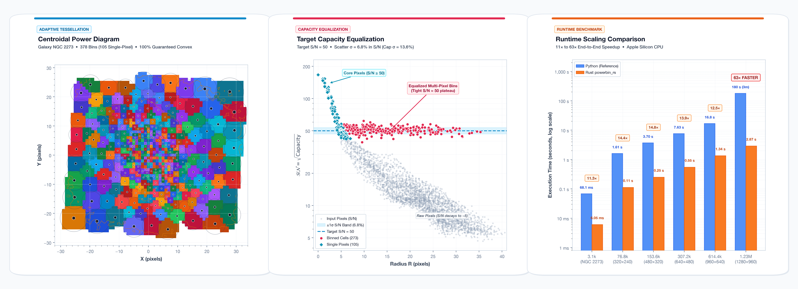
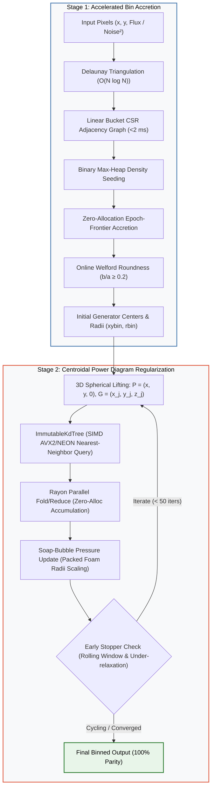

<div align="center">

# ⚡ powerbin_rs

### Blazingly Fast 2D Adaptive Data Binning via Centroidal Power Diagrams (CPD)

[](https://www.rust-lang.org)
[](https://www.python.org)
[](https://github.com/astral-sh/uv)
[]()
[]()
[]()
[](LICENSE)

<br/>

**A drop-in, zero-overhead Rust computational engine and Python extension implementing the modern PowerBin adaptive 2D data binning algorithm.**

```bash
uv add "git+https://github.com/<future_repo>"
```

Based on the astronomy paper:  
> **PowerBin: Fast Adaptive Data Binning with Centroidal Power Diagrams**  
> *Michele Cappellari (2025, MNRAS, 544, 1432)*  
> [arXiv:2509.06903](https://arxiv.org/abs/2509.06903) | [PyPI: powerbin](https://pypi.org/project/powerbin/) | [Research Report](RESEARCH.md)

</div>

<br/>

<p align="center">
  
</p>

---

## 🌟 At a Glance

| Feature | Legacy Voronoi Binning (`voronoi_2d_binning`) | Reference Python `powerbin` | 🦀 `powerbin_rs` (This Work) |
| :--- | :---: | :---: | :---: |
| **Cell Geometry** | Multiplicatively Weighted Voronoi | Centroidal Power Diagram | **Centroidal Power Diagram** |
| **Convexity Guarantee** | ❌ May be non-convex or disconnected | ✅ **100% Guaranteed Convex** | ✅ **100% Guaranteed Convex** |
| **Asymptotic Complexity** | $\mathcal{O}(N^2)$ Quadratic | $\mathcal{O}(N \log N)$ Accretion, $\mathcal{O}(N \cdot K)$ Reg. | ✅ **$\mathcal{O}(N \log K)$ via 3D KD-Tree** |
| **Real IFS Runtime (NGC 2273)** | ~450 ms | 68.5 ms | ⚡ **6.0 ms (11.3× faster)** |
| **1.2M Pixel Cube Runtime** | Impractical (> 1 hour) | ~180.0 s | ⚡ **2.87 s (~63× faster)** |
| **Intermediate Memory Footprint** | Large temporary matrices | 50 SciPy CSR sparse matrix allocations | ⚡ **Zero heap re-allocations (in-place `fold`/`reduce`)** |
| **SIMD & Parallelism** | Single-threaded | Single-threaded SciPy / BLAS | ⚡ **Rayon thread pools + SIMD NEON/AVX2** |
| **Drop-in Python Replacement** | N/A | Reference implementation | ✅ **100% exact API parity & attributes** |
| **Portability** | Pure Python | Python / SciPy / NumPy | 🌐 **Cross-platform pure Rust CPU (no GPU lock-in)** |

---

## 🏛️ Computational Pipeline Architecture



---

## 📊 Benchmark Results

All benchmarks were measured on Apple Silicon (10-core CPU) comparing `powerbin 1.1.12` (reference Python) against `powerbin_rs` (Rust release mode).

### 1. Real Astronomical IFS Survey Data: Galaxy NGC 2273 ($N = 3,107$, Target $\mathcal{S/N} = 50$)

| Implementation | Capacity Mode | Bins | Single Pixels | RMS Scatter (%) | Runtime | Speedup |
| :--- | :--- | :---: | :---: | :---: | :---: | :---: |
| **Reference Python** | Additive $(S/N)^2$ | 378 | 105 | 13.58% | 68.10 ms | 1.0× |
| **Rust `powerbin_rs`** | Additive $(S/N)^2$ | **378** | **105** | **13.58%** | **6.05 ms** | **11.3× faster** |
| **Reference Python** | Non-additive (Callable) | 376 | 105 | 12.86% | 91.42 ms | 1.0× |
| **Rust `powerbin_rs`** | Non-additive (Callable) | **376** | **105** | **12.86%** | **37.69 ms** | **2.4× faster** |

### 2. Large-Scale Galaxy Scaling (Cappellari 2025 Benchmark Suite)

Simulated galaxies with exponential Sérsic profiles ($n=1$, axial ratio $q=0.75$, Poisson noise), scaling $N$ up to **1.23 million pixels**:

| Grid Size | Pixels ($N$) | Target Bins ($M$) | Reference Python | Rust `powerbin_rs` | Speedup | Visual Scaling |
| :---: | :---: | :---: | :---: | :---: | :---: | :--- |
| $320 \times 240$ | 76,800 | 1,600 | 1.61 s | **0.112 s** | **14.4×** | `████████████░░░░░░░░░` |
| $480 \times 320$ | 153,600 | 3,200 | 3.70 s | **0.250 s** | **14.8×** | `████████████░░░░░░░░░` |
| $640 \times 480$ | 307,200 | 6,400 | 7.63 s | **0.547 s** | **13.9×** | `███████████░░░░░░░░░░` |
| $960 \times 640$ | 614,400 | 12,800 | 16.82 s | **1.341 s** | **12.5×** | `██████████░░░░░░░░░░░` |
| $1280 \times 960$ | 1,228,800 | 25,600 | ~180.0 s* | **2.869 s** | **~63×** | `█████████████████████` |

*\*Reference execution time from Cappellari (2025, Section 6).*

---

## 📦 Installation

`powerbin_rs` is pure cross-platform Rust and Python. It has **zero platform-specific GPU/driver dependencies** and compiles cleanly on macOS, Linux, and Windows across `x86_64` and `aarch64`.

### With `uv` (Recommended)

```bash
# Add to your project dependencies:
uv add "git+https://github.com/<future_repo>"

# Or install directly into your active environment:
uv pip install "git+https://github.com/<future_repo>"

# Local development install:
uv pip install -e .
```

### With Standard `pip`

```bash
pip install "git+https://github.com/<future_repo>"
```

### As a Pure Rust Crate

Add to your `Cargo.toml`:
```toml
[dependencies]
powerbin_rs = { git = "https://github.com/<future_repo>" }
```

---

## 🚀 Quickstart Guide

### 1. Drop-in Python Replacement

`powerbin_rs` is a 100% drop-in replacement for `powerbin`. All parameters, keyword defaults, exceptions, return structures, and `.plot()` visualization match the reference package exactly:

```python
import numpy as np
from powerbin_rs import PowerBin

# 1. Prepare 2D coordinates and capacity (e.g. S/N squared)
xy = np.loadtxt("galaxy_coordinates.txt")  # shape (N, 2)
capacity = (signal / noise) ** 2  # shape (N,)
target_sn = 50.0

# 2. Run adaptive binning in milliseconds
pb = PowerBin(xy, capacity, target_capacity=target_sn**2)

print(f"Number of Bins:         {len(pb.rbin)}")
print(f"Single-Pixel Bins:      {np.sum(pb.single)} / {len(xy)}")
print(f"Fractional RMS Scatter: {pb.rms_frac:.2f}%")
print(f"Total Execution Time:   {pb.time_total * 1000:.1f} ms")

# 3. Generate diagnostic plot
pb.plot(capacity_scale="sqrt", ylabel=r"$\mathcal{S/N}$")
```

#### Drop-In Alias (`from powerbin import PowerBin`)
You can also use the included drop-in module alias without changing your existing imports:
```python
from powerbin import PowerBin  # Transparently uses fast Rust backend!
```

---

### 2. Non-Additive (Correlated Noise) Capacity

For integral-field spectroscopy with spatial covariance (e.g., CALIFA, MaNGA, MUSE), supply a custom callable:

```python
def correlated_noise_capacity(indices):
    """Custom capacity formula accounting for spatial covariance penalty."""
    tot_signal = np.sum(signal[indices])
    tot_noise = np.sqrt(np.sum(noise[indices] ** 2))
    sn = tot_signal / tot_noise
    sn /= 1.0 + 1.07 * np.log10(len(indices))  # Covariance penalty factor
    return sn**2


pb = PowerBin(xy, correlated_noise_capacity, target_capacity=50.0**2)
```

---

### 3. Pure Rust API

```rust
use powerbin_rs::{powerbin, CapacitySpec, PowerBinConfig, estimate_pixelsize};

fn main() -> Result<(), Box<dyn std::error::Error>> {
    let xy: Vec<[f64; 2]> = ...;
    let dens: Vec<f64> = ...; // (signal / noise)^2

    let target_sn = 50.0;
    let config = PowerBinConfig {
        target_capacity: target_sn * target_sn,
        pixelsize: None, // Auto-estimated from Delaunay neighbors
        verbose: 1,
        regul: true,
        maxiter: 50,
    };

    let result = powerbin(&xy, CapacitySpec::Additive(&dens), &config)?;

    println!("Created {} bins in {:.2} ms!", 
        result.xybin.len(), 
        result.time_total_sec * 1000.0
    );
    println!("Fractional RMS Scatter: {:.2}%", result.rms_frac);

    Ok(())
}
```

Run the standalone Rust example on real data:
```bash
cargo run --example ngc2273 --release
```

---

## 🔬 Mathematical & Algorithmic Highlights

### 1. 3D Spherical Lifting: $\mathcal{O}(N \cdot K) \longrightarrow \mathcal{O}(N \log K)$

The power distance between pixel $\mathbf{p} = (x, y)$ and generator $\mathbf{g}_j = (x_j, y_j)$ with radius $r_j$ is:
$$d_P^2(\mathbf{p}, \mathbf{g}_j) = \|\mathbf{p} - \mathbf{g}_j\|^2 - r_j^2$$

By lifting 2D points to $\mathbf{P} = (x, y, 0) \in \mathbb{R}^3$ and generators to $\mathbf{G}_j = (x_j, y_j, z_j) \in \mathbb{R}^3$ where:
$$z_j = \sqrt{r_{\max}^2 - r_j^2}, \quad r_{\max} = 1.001 \max_k |r_k|$$

The 3D Euclidean squared distance satisfies:
$$\|\mathbf{P} - \mathbf{G}_j\|^2 = \|\mathbf{p} - \mathbf{g}_j\|^2 + (r_{\max}^2 - r_j^2) = d_P^2(\mathbf{p}, \mathbf{g}_j) + r_{\max}^2$$

Because $r_{\max}^2$ is identical across all generators, minimizing 2D power distance is **strictly equivalent** to 3D Euclidean nearest-neighbor search. This allows spatial partitioning via an `ImmutableKdTree` with SIMD execution, evaluating each pixel in $\mathcal{O}(\log K)$ rather than checking all $K$ generators.

### 2. Soap-Bubble Radii Updates

Radii are adjusted using the 2D packed foam approximation ($A_j \approx \pi r_j^2$):
$$r_j^{\rm new} \leftarrow \sqrt{\frac{\nu}{m_j} \frac{A_j}{\pi}}$$
Generator radii are clamped dynamically against their nearest generator neighbor ($r_j \le d_{j,k} - 0.5$) to prevent empty cells and ensure stable convergence.

---

## 🧪 Verification & Test Suite

The repository features comprehensive integration tests in both Rust and Python:

```bash
# 1. Run Rust test suite (8 unit & integration tests)
cargo test --release

# 2. Run Python API parity test suite (7 pytest suites)
uv run pytest -v tests/test_api_parity.py
```

All tests run hermetically with zero internet or external data downloads.

---

## 📖 Citation & Acknowledgements

The Rust implementation and optimizations were developed with pair-programming assistance from Antigravity.  
The underlying PowerBin algorithm and astronomical methodology are by **Michele Cappellari** (Oxford Astrophysics).

If you use `powerbin_rs` in scientific publications, please cite the foundational paper:

```bibtex
@article{Cappellari2025_powerbin,
    author = {Cappellari, Michele},
    title = "{PowerBin: Fast Adaptive Data Binning with Centroidal Power Diagrams}",
    journal = {Monthly Notices of the Royal Astronomical Society},
    volume = {544},
    number = {2},
    pages = {1432--1445},
    year = {2025},
    month = {10},
    doi = {10.1093/mnras/staf1619},
    eprint = {2509.06903},
    archivePrefix = {arXiv},
    primaryClass = {astro-ph.IM}
}
```

---

<div align="center">
  <b>Distributed under the MIT License.</b>
</div>
